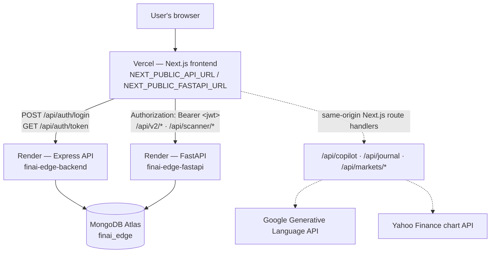
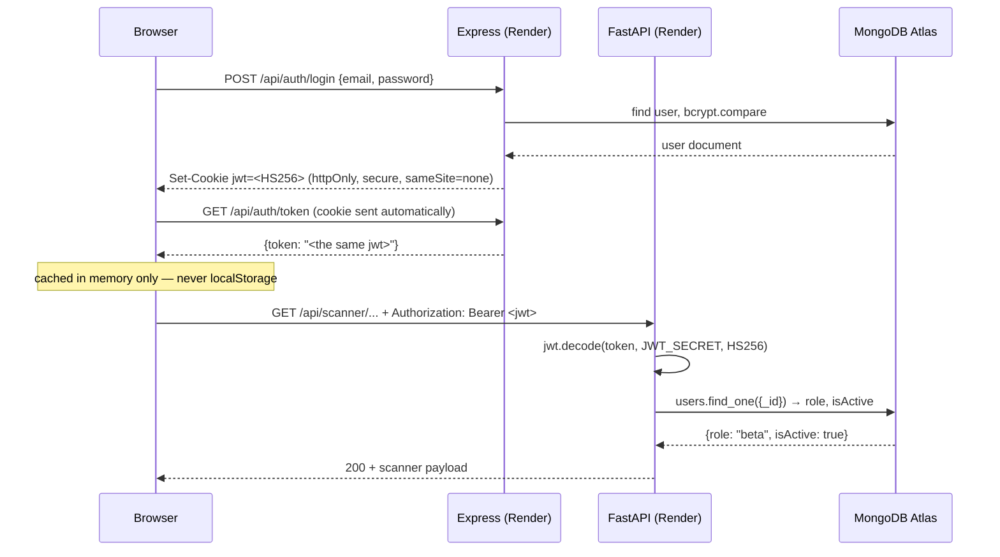

# Deployment Master Plan

**Status:** technical reference. Written by auditing the repository at commit `5b7f6d3` on branch `akarsh-feature`.
**Companion document:** [`BEGINNER_DEPLOYMENT_GUIDE.md`](./BEGINNER_DEPLOYMENT_GUIDE.md) — the same deployment, written step-by-step for someone who has never deployed anything.

> **No secrets in this document.** Every credential appears as a placeholder such as `<YOUR_MONGODB_URI>`.
> Do not copy a placeholder literally — replace it with your real value, and only ever type real values
> into a hosting dashboard or a local `.env` file that git ignores.

> **Verification convention.** Everything below was read out of the current repository. Where the repository
> cannot answer a question (a third-party dashboard's button labels, an account you own), the text says
> **NOT VERIFIED — USER MUST CONFIRM** instead of guessing.

---

## 1. Deployment Goal

Take FinAI Edge — today a three-process app running on one Windows laptop — and put it on the public
internet as four managed pieces: a Vercel-hosted frontend, two Render-hosted backends, and a MongoDB
Atlas database.

The frontend talks to **both** backends directly. Express does **not** proxy to FastAPI — they are
independent services that happen to share a database and a JWT signing secret.



Two things are worth stating plainly, because they drive most of the deployment order:

1. **Express is the only service that issues a JWT. FastAPI only verifies one.** Both read the same
   `JWT_SECRET`. If those two values differ by even one character, login appears to succeed and then
   every scanner call returns 401.
2. **The frontend's backend URLs are baked into the JavaScript bundle at build time.** They are
   `NEXT_PUBLIC_*` variables, which Next.js inlines during `next build`. Changing them in the Vercel
   dashboard does nothing until you redeploy.

### Where OHLCV data lives

The scanner pipeline needs ~2,200 symbols of daily OHLCV history. There are two storage backends and
**no automatic failover between them** — the choice is made explicitly by one setting.

| | Local development | Production |
|---|---|---|
| Setting | `OHLCV_BACKEND=csv` (this is the code default in `config.py`) | `OHLCV_BACKEND=mongo` (hardcoded in `render.yaml`) |
| Source | `backend/data/Stock_Data.csv` | MongoDB `ohlcv` collection, one document per symbol |
| Read pattern | whole file loaded into RAM | per-symbol, 128-entry LRU + 50-symbol read-ahead |
| Present in git? | **No** — gitignored (`.gitignore:40`) | n/a — lives in Atlas |

`backend/data/Stock_Data.csv` is **123,745,199 bytes (~124 MB)** on this machine and is gitignored, so it
does not exist on Render. That is the entire reason production must use Mongo.

> ⚠️ **Consistency note.** `render.yaml` and `docs/PRIVATE-BETA.md` both describe this file as "196 MB".
> The file on disk today is ~124 MB. The reasoning in those comments is unaffected — the file is far too
> large for git either way — but do not treat 196 MB as a current measurement.

The CSV is never written to, moved, or deleted by the Mongo path, and the migration script opens it
read-only. **Do not delete it.** It is the rollback: flipping `OHLCV_BACKEND` back to `csv` restores the
old behaviour with no code change.

If `OHLCV_BACKEND=mongo` and the `ohlcv` collection is empty, `get_cached_symbols()` in
`backend/fastapi_app/services/ohlc_downloader.py:172` raises a `RuntimeError` rather than returning an
empty universe. That is deliberate: a scan over zero symbols would publish zero results and wipe every
live scanner cache. **The migration must run before FastAPI's first scan.**

---

## 2. Current Architecture

| Component | Technology | Local | Production | Hosting |
|---|---|---|---|---|
| Frontend | Next.js 15.5 (App Router), React 18.3, TypeScript 5, Tailwind | `npm run dev` → port **9002** | `npm run build` → static/SSR bundle | **Vercel** (root directory `frontend`) |
| Express backend | Node/Express 4.19, Mongoose 8.13, helmet, express-rate-limit | `npm start` / `npm run dev` → port **8080** | `npm start`, binds Render's `$PORT` (`PORT=8080` set in `render.yaml`) | **Render** — service `finai-edge-backend`, `rootDir: backend` |
| FastAPI backend | FastAPI 0.115, uvicorn, Motor 3.6 + pymongo 4.9, pandas 2.2 / numpy 1.26, LangGraph | `uvicorn main:app --port 8000` → port **8000** | `uvicorn main:app --host 0.0.0.0 --port $PORT` | **Render** — service `finai-edge-fastapi`, `rootDir: backend/fastapi_app` |
| Database | MongoDB | `mongodb://localhost:27017/finai_edge` (default in both configs) | MongoDB Atlas **M0 free tier** | **MongoDB Atlas** |
| OHLCV data | CSV *or* Mongo `ohlcv` collection | `OHLCV_BACKEND=csv` → `backend/data/Stock_Data.csv` | `OHLCV_BACKEND=mongo` → `ohlcv` collection | local disk / Atlas |
| Authentication | Express-issued HS256 JWT; FastAPI verifies | cookie `sameSite: 'lax'`, `secure: false` | cookie `sameSite: 'none'`, `secure: true` | Express on Render |
| AI / Copilot | Gemini (`google-generativeai` + `langchain-google-genai`), Groq failover, LangGraph agent | optional — degrades gracefully without keys | same; keys are `sync: false` in `render.yaml` | Render (FastAPI) + Vercel (Next.js route handlers) |
| Uploads / storage | `StorageProvider` abstraction, `storage_backend="local"` → `backend/fastapi_app/uploads/` | works | **ephemeral** — see §15 | Render disk (not persistent on free tier) |
| Scheduler | APScheduler, `timezone="Asia/Kolkata"` | runs while the process runs | see §15 caveat about free-tier spin-down | Render (FastAPI) |

**Verified detail on the scheduler.** `backend/fastapi_app/schedulers/daily_refresh.py:506` constructs
`AsyncIOScheduler(timezone="Asia/Kolkata")` and registers two jobs: `pre_market_check` at **08:00 IST**
and `daily_scan` at **09:00 IST**. The module docstring and the startup log line in `main.py` both say
"15:45 IST" — those strings are stale; the cron triggers in code are 08:00 and 09:00.

**Verified detail on the frontend's `/api/markets/*` calls.** `frontend/src/app/(app)/markets/*` fetches
relative paths (`/api/markets/mission-control`, `/pulse`, `/movers`), which resolve to **Next.js route
handlers** under `frontend/src/app/api/`, not to the Express `/api/markets` router. Those handlers call
Yahoo Finance and Google's Generative Language API directly from the Vercel server runtime.

---

## 3. Pre-Deployment Requirements

### 🧑 The user must have

These require accounts, payment methods, or a browser session that no automated tool in this repository
can supply.

| Requirement | Why | Cost |
|---|---|---|
| A **GitHub account** with push access to `https://github.com/Poorvansh45/FinTechAi` | Render and Vercel deploy from the repo | free |
| A **MongoDB Atlas account** | the database | free (M0) |
| A **Render account** (sign in with GitHub is simplest) | both backends | free tier |
| A **Vercel account** (sign in with GitHub is simplest) | the frontend | free (Hobby) |
| **Python 3.11+ and Node.js 20+ installed locally** | the OHLCV migration and the user-seeding scripts run **from your laptop against Atlas**, not on Render | free |
| The local `backend/data/Stock_Data.csv` | it is the migration's source | already present |
| A **strong random `JWT_SECRET`** (32+ chars) that you generate and keep | signs every session | free |
| A **Google AI Studio API key** — optional | Gemini copilot; the app degrades gracefully without it | free tier available |
| **Groww / Finnhub keys** — optional | market data fallbacks | varies |
| A **custom domain** — optional | NOT VERIFIED — no domain configuration exists anywhere in this repository | varies |

### 🤖 Claude can prepare

Everything that is a file in this repository:

- inspect and report the current deployment configuration (this document is that)
- write and update documentation
- draft environment-variable templates (e.g. a `frontend/.env.example`, which does not exist today)
- read `render.yaml` / `vercel.json` and explain exactly which dashboard fields they cover
- run the local test suites and report the results
- prepare and explain the exact terminal commands, with the correct working directory
- read error output you paste back and diagnose it
- propose code changes for you to review (a separate, explicitly-authorised task — not this one)

### 🚫 Claude cannot do

There is **no connected Render, Vercel, MongoDB Atlas, or GitHub dashboard tool** in this environment.
Claude cannot click "Deploy", cannot create your Atlas cluster, cannot paste a secret into a Render
dashboard, and cannot see your deployment logs unless you copy them into the chat.

---

## 4. Deployment Order

The order below is not arbitrary. Three real constraints force it:

1. **The migration and the seeding scripts run on your laptop against Atlas.** Both read the CSV or need
   an interactive TTY. So Atlas must exist, and its URI must be in `backend/.env`, *before* either runs.
2. **FastAPI boots with `OHLCV_BACKEND=mongo`** and will raise on an empty `ohlcv` collection the moment a
   scan is attempted. So migrate *before* Render's FastAPI service does any real work.
3. **Vercel needs the Render URLs at build time; Render needs the Vercel URL for CORS.** That is circular,
   so it is broken deliberately: deploy Render first (it boots fine with an incomplete CORS list), then
   Vercel, then come back and set `FRONTEND_URL` on both Render services and restart them.

| # | Step | Who | Notes |
|---|---|---|---|
| 1 | Final local verification — typecheck, both test suites | 🤖 Claude can run | §17 checklist |
| 2 | `git status` — confirm no `.env`, no CSV, no key is staged | 🤝 both | §14 |
| 3 | Commit and push to GitHub | 🧑 user | Render/Vercel deploy from a branch |
| 4 | Decide the deployment branch | 🧑 user | CI currently runs on `main`; you are on `akarsh-feature` |
| 5 | Create the MongoDB Atlas M0 cluster, DB user, network access | 🧑 user | §6 |
| 6 | Put the Atlas URI into local `backend/.env` | 🧑 user | needed by steps 7–8 |
| 7 | **Run the OHLCV migration** (laptop → Atlas) | 🧑 user runs, 🤖 Claude verifies output | §7 — the long one |
| 8 | **Seed accounts + set passwords** (laptop → Atlas) | 🧑 user, interactively | §8 |
| 9 | Create the Render Blueprint from `render.yaml` → both services | 🧑 user | §9 |
| 10 | Fill every `sync: false` secret on **both** Render services | 🧑 user | §5 |
| 11 | Record the two Render URLs | 🧑 user | needed by step 12 |
| 12 | Create the Vercel project, root directory `frontend`, set `NEXT_PUBLIC_*` | 🧑 user | §10 |
| 13 | Deploy on Vercel, record the production URL | 🧑 user | |
| 14 | Set `FRONTEND_URL` = the Vercel URL on **both** Render services | 🧑 user | closes the CORS loop |
| 15 | Restart / redeploy both Render services | 🧑 user | env changes need a restart |
| 16 | Authentication test — login, token, a protected FastAPI call | 🤝 both | §11 |
| 17 | Scanner test — a screener page loads real data | 🧑 user | §12 |
| 18 | Full production smoke test | 🤝 both | §12 |
| 19 | Security verification | 🤝 both | §14 |

> **On step 4.** `.github/workflows/ci.yml` runs on pushes to `main` and `claude-production-cleanup`, and on
> pull requests targeting `main`. Pushing `akarsh-feature` directly runs no CI. Whether you merge to `main`
> first or point Render/Vercel at `akarsh-feature` is your call — but **pick one branch and use the same one
> for both hosts**, or the frontend and backends will drift apart. `render.yaml` does not pin a branch, so
> Render will ask. **NOT VERIFIED — USER MUST CONFIRM** which branch you intend to deploy.

---

## 5. Environment Variable Master Table

> **Placeholders.** `<YOUR_MONGODB_URI>` is a placeholder. Do not paste that text anywhere. Replace it with
> your real connection string, typed directly into the Render/Vercel dashboard or into a local `.env` file
> that git already ignores.

### 5.1 Frontend / Vercel

Read by `frontend/src/config/env.ts` and `frontend/src/app/layout.tsx`.

| Variable | Required? | Example format | Where obtained | Secret? | When needed |
|---|---|---|---|---|---|
| `NEXT_PUBLIC_API_URL` | **Yes** | `https://finai-edge-backend.onrender.com` | Render, after step 11 | No | **Build time** |
| `NEXT_PUBLIC_FASTAPI_URL` | **Yes** | `https://finai-edge-fastapi.onrender.com` | Render, after step 11 | No | **Build time** |
| `NEXT_PUBLIC_APP_URL` | Optional | `https://<your-app>.vercel.app` | Vercel, after first deploy | No | **Build time** |
| `GOOGLE_API_KEY` *or* `GEMINI_API_KEY` | Optional | `AIza…` | [Google AI Studio](https://aistudio.google.com/app/apikey) | **YES** | Runtime (server-side) |

Notes verified from code:

- `readPublicEnv()` in `frontend/src/config/env.ts:29` falls back to `http://localhost:8080` /
  `http://localhost:8000` when a variable is missing, and logs a warning in production **but still returns
  the localhost fallback**. A production build with these unset therefore *succeeds* and then fails in the
  browser with connection errors to `localhost`. This is the single most likely "deployed but nothing
  works" cause. See §17's troubleshooting entry.
- `NEXT_PUBLIC_APP_URL` is used **only** at `frontend/src/app/layout.tsx:20` for `metadata.metadataBase`
  (Open Graph / social card URLs). It does not affect API calls.
- `GOOGLE_API_KEY` / `GEMINI_API_KEY` are read inside Next.js **route handlers**
  (`frontend/src/app/api/copilot/chat/route.ts:35`, `frontend/src/app/api/journal/analyze/route.ts:26`).
  They have **no** `NEXT_PUBLIC_` prefix, so they are never shipped to the browser. Without one, the
  copilot route returns a clearly-labelled `[Demo Mode]` mock response rather than failing.

### ⚠️ Which variables need a redeploy

`NEXT_PUBLIC_*` variables are **inlined into the JavaScript bundle by `next build`**. They are not read at
runtime. Concretely:

- Changing `NEXT_PUBLIC_API_URL` in the Vercel dashboard changes **nothing** about the site that is
  currently live.
- You must trigger a **new deployment** for the new value to take effect.
- Non-public variables (`GOOGLE_API_KEY`) are read server-side at request time, but Vercel still binds
  environment variables per-deployment — so **redeploy after any environment change**, without exception.

### 5.2 Express / Render — `finai-edge-backend`

Read by `backend/config/env.js`.

| Variable | Required? | Example format | Where obtained | Secret? | When needed |
|---|---|---|---|---|---|
| `NODE_ENV` | Yes | `production` | already in `render.yaml` | No | boot |
| `PORT` | Yes | `8080` | already in `render.yaml` | No | boot |
| `FRONTEND_URL` | **Yes** | `https://<your-app>.vercel.app` | Vercel, after step 13 | No | boot — CORS allow-list |
| `MONGODB_URI` | **Yes** | `mongodb+srv://<user>:<pw>@<cluster>.mongodb.net/finai_edge?retryWrites=true&w=majority` | Atlas | **YES** | boot |
| `JWT_SECRET` | **Yes** | 32+ random chars | you generate it | **YES** | boot — **process throws without it** |
| `JWT_EXPIRE` | Optional | `30d` | — | No | boot (default `30d`) |
| `FINNHUB_API_KEY` | Optional | — | [finnhub.io](https://finnhub.io/dashboard) | **YES** | runtime |

Verified details:

- `backend/config/env.js:18` throws `[FATAL] JWT_SECRET is not set…` when `NODE_ENV=production` and
  `JWT_SECRET` is absent. The service will not boot. This is intentional and good.
- `MONGO_URI` is accepted as an alias for `MONGODB_URI` (`backend/config/env.js:7`).
- `JWT_EXPIRE`, `FINNHUB_API_KEY`, and the `MONGO_URI` alias are **not** listed in `render.yaml`. Add them
  in the Render dashboard only if you want them.
- `FASTAPI_URL` appears in `backend/.env.example:43` but is **not read by any Express source file**. It is
  vestigial. Do not bother setting it on Render.

### 5.3 FastAPI / Render — `finai-edge-fastapi`

Read by `backend/fastapi_app/config.py` (pydantic-settings; env var names are the uppercase form of each
field, matched case-insensitively).

| Variable | Required? | Example format | Where obtained | Secret? | When needed |
|---|---|---|---|---|---|
| `PYTHON_VERSION` | Yes | `3.11.9` | already in `render.yaml` | No | build |
| `ENVIRONMENT` | Yes | `production` | already in `render.yaml` | No | boot |
| `LOG_LEVEL` | Optional | `INFO` | already in `render.yaml` | No | boot |
| `OHLCV_BACKEND` | **Yes** | `mongo` | already in `render.yaml` | No | boot — **must be `mongo`** |
| `FRONTEND_URL` | **Yes** | `https://<your-app>.vercel.app` | Vercel | No | boot — CORS allow-list |
| `MONGODB_URI` | **Yes** | same string as Express | Atlas | **YES** | boot |
| `JWT_SECRET` | **Yes** | **byte-identical to Express's** | you generate it | **YES** | boot — **process raises without it** |
| `GEMINI_API_KEY` | Optional | `AIza…` | Google AI Studio | **YES** | runtime |
| `GROQ_API_KEY` | Optional | `gsk_…` | [console.groq.com](https://console.groq.com) | **YES** | runtime |
| `GROWW_API_KEY` | Optional | — | Groww | **YES** | runtime |
| `GROWW_TOTP_SECRET` | Optional | — | Groww | **YES** | runtime |
| `FINNHUB_API_KEY` | Optional | — | finnhub.io | **YES** | runtime |

Optional tuning fields that exist in `config.py` but are **not** in `render.yaml` — leave them unset unless
you have a reason: `FASTAPI_PORT`, `AI_MODEL_PROVIDER`, `GEMINI_MODEL`, `GROQ_MODEL`, `OPENAI_API_KEY`
(placeholder, provider not wired), `STORAGE_BACKEND`, `WORKSPACE_UPLOADS_DIR`, `WORKSPACE_MAX_UPLOAD_MB`,
`STORAGE_PUBLIC_BASE_URL`, `UPSTOX_INSTRUMENTS_URL`, `OHLC_PRIMARY_PROVIDER` (kept for backward compat,
**no longer read** — OHLCV always comes from Upstox), `QUOTE_CACHE_TTL`, `CANDLE_CACHE_TTL`,
`ANALYTICS_CACHE_TTL`, `RISK_FREE_RATE`, `TRADING_DAYS`, `MONTE_CARLO_SIMULATIONS`, `MIN_HISTORY_DAYS`,
`MIN_ASSETS`.

Verified details:

- `get_settings()` at `backend/fastapi_app/config.py:150` raises `RuntimeError("[FATAL] JWT_SECRET is not
  set…")` when `ENVIRONMENT=production` and the `JWT_SECRET` **environment variable** is absent. Note it
  checks `os.environ` directly, so a value supplied only via a `.env` file would not satisfy it in
  production.
- `config.py`'s `env_file` is `"../.env"` — **relative to the process working directory**. On Render the
  working directory is `backend/fastapi_app` (via `rootDir`) and no `backend/.env` is deployed, so
  pydantic-settings reads the injected Render environment variables directly. No code change is needed.
- Locally, that same `"../.env"` means FastAPI reads **`backend/.env`** — *not* `backend/fastapi_app/.env`.
  `backend/fastapi_app/.env.example` exists and is misleading on this point.

### 5.4 MongoDB Atlas

Not an environment variable, but the value that produces one.

| Item | Format | Secret? |
|---|---|---|
| Cluster tier | M0 (free) | No |
| Database name | `finai_edge` | No |
| Database user | `<YOUR_DB_USERNAME>` | No |
| Database password | `<YOUR_DB_PASSWORD>` | **YES** |
| Connection string | `mongodb+srv://<YOUR_DB_USERNAME>:<YOUR_DB_PASSWORD>@<cluster>.mongodb.net/finai_edge?retryWrites=true&w=majority` | **YES** |

> **Include `/finai_edge` in the URI path.** FastAPI calls `get_default_database("finai_edge")`
> (`main.py:56`, `services/ohlcv_store.py:99`), which uses the database named in the URI and only falls back
> to `finai_edge` if the URI names none. Express calls `mongoose.connect(env.mongoUri)` with no explicit
> database. If the URI omits the database path, the two services can end up reading and writing **different
> databases** — logins that "work" against an empty collection, scanners that find nothing. Always name it
> explicitly, and use the **same URI string** for both services.

### 5.5 Optional integrations

| Integration | Variables | Behaviour without it |
|---|---|---|
| Gemini (FastAPI copilot + AI portfolio) | `GEMINI_API_KEY` | rule-based fallback; `settings.gemini_available` is `False`, surfaced at `/health` |
| Groq (secondary LLM) | `GROQ_API_KEY` | LLMManager tries Gemini first and fails over to Groq; either one alone is sufficient (`copilot_llm_available`) |
| Gemini (Next.js route handlers) | `GOOGLE_API_KEY` / `GEMINI_API_KEY` on **Vercel** | `/api/copilot/chat` returns a labelled `[Demo Mode]` mock |
| Groww market data | `GROWW_API_KEY` + `GROWW_TOTP_SECRET` (both required together) | falls back to yfinance for live quotes |
| Finnhub | `FINNHUB_API_KEY` (Express and/or FastAPI) | Express `/api/markets/*` returns an error from `marketService.js:30`; FastAPI treats it as an unavailable tertiary fallback |

---

## 6. MongoDB Atlas Setup

Atlas's UI changes; the section *names* below are stable, the exact button labels may not be.
Where a label could differ, this document names the section rather than pretending to know the button.

**🧑 USER MUST DO THIS.** Claude has no Atlas access.

1. **Create the account and a project.** Go to <https://www.mongodb.com/cloud/atlas>. Sign up or sign in.
2. **Create an M0 cluster.** Look for the option to deploy a new cluster and choose the **M0 / Free**
   tier. Pick a cloud provider and region — choose one geographically close to Render's `ohio` region
   (`render.yaml` sets `region: ohio` for both services) to keep round-trip latency low. This matters
   more than usual here: `services/ohlcv_store.py` documents 116 ms/symbol unbatched versus 6.7 ms at
   batch 50, i.e. Atlas round-trip latency dominates a full scan.
3. **Create a database user.** Find the **Database Access** section. Create a user with a username and a
   password you generate. Give it read/write access to the database. **Write the password down somewhere
   safe — Atlas will not show it again.** Do not reuse a password from anywhere else.
   - If your password contains `@`, `:`, `/`, or `?`, it must be **percent-encoded** in the connection
     string or the URI will not parse. The simplest fix is to generate a password with letters and digits
     only.
4. **Configure network access.** Find the **Network Access** section (sometimes labelled IP Access List).
   Add an entry.
   - **Render's free tier does not provide a static outbound IP address.** So an allow-list of specific IPs
     will not reliably work, and the practical option is `0.0.0.0/0` ("allow access from anywhere").
   - **Security implication, stated honestly:** `0.0.0.0/0` means the network layer stops filtering
     entirely. Your database's only remaining defence is the username and password. That makes a strong,
     unique, never-committed database password load-bearing rather than merely good practice. Rotate it if
     it is ever pasted anywhere it shouldn't be.
   - **NOT VERIFIED — USER MUST CONFIRM:** whether your Render plan offers static outbound IPs. If it does,
     allow-list those instead of `0.0.0.0/0`.
5. **Get the connection string.** Find the **Connect** action on your cluster, choose the driver/application
   option, and copy the `mongodb+srv://…` string.
6. **Edit it before use.** Replace `<password>` with your real password, and make sure the database name
   `finai_edge` appears in the path:

   ```
   mongodb+srv://<YOUR_DB_USERNAME>:<YOUR_DB_PASSWORD>@<cluster>.mongodb.net/finai_edge?retryWrites=true&w=majority
   ```

7. **Where this value gets pasted — three places, all typed by hand:**
   - your local `backend/.env` as `MONGODB_URI=` (gitignored — needed for §7 and §8)
   - Render → `finai-edge-backend` → environment → `MONGODB_URI`
   - Render → `finai-edge-fastapi` → environment → `MONGODB_URI`

   It goes **nowhere else**. Never into a committed file, never into this document, never into a chat.

**Storage budget.** M0 gives 512 MB. `docs/PRIVATE-BETA.md` records a measured 2,207 symbols / 2,256,535
bars = **82 MB** for the `ohlcv` collection, with the whole database at **190 MB**, growing ~35 MB/year.
That fits comfortably, with roughly 322 MB of headroom.

---

## 7. OHLCV Migration

### Why this exists

`backend/data/Stock_Data.csv` is gitignored (`.gitignore:40`), ~124 MB, and Render's filesystem is
ephemeral. It will never be on the server. Meanwhile `render.yaml` hardcodes `OHLCV_BACKEND=mongo` for the
FastAPI service. So the `ohlcv` collection must be populated **before** production does anything real —
otherwise `get_cached_symbols()` raises, and if that guard were absent a zero-symbol scan would publish an
empty result set and wipe every live scanner cache.

The migration runs **on your Windows laptop**, reading the local CSV and writing to Atlas over the internet.
It does not run on Render.

### 🧑 USER RUNS · 🤖 CLAUDE VERIFIES THE OUTPUT

**Prerequisite:** `backend/.env` must already contain the Atlas `MONGODB_URI`, because `config.py` resolves
`env_file="../.env"` relative to the working directory.

**WHERE TO RUN:** Windows PowerShell (or CMD — the commands below are identical in both)

**CURRENT DIRECTORY:** `C:\path\to\FinTechAi\backend\fastapi_app`

```bash
cd backend\fastapi_app
```

**COMMAND — smoke test first (50 symbols, ~seconds):**

```bash
python scripts/migrate_ohlcv_to_mongo.py --limit 50
```

**COMMAND — the real run:**

```bash
python scripts/migrate_ohlcv_to_mongo.py
```

**EXPECTED OUTPUT** (shape, not exact numbers):

```
source : C:\...\backend\data\Stock_Data.csv  (124 MB)
target : MongoDB 'ohlcv'  (CSV is read-only here)

    200 symbols ·   210,433 bars ·  18.4s
    400 symbols ·   421,880 bars ·  35.9s
    ...

wrote 2207 symbols / 2,256,535 bars in 214.7s
collection now: 2207 symbols, 2,256,535 bars, 2021-07-11 -> 2026-08-06

verifying MongoDB against C:\...\backend\data\Stock_Data.csv

mongo :  2207 symbols   2,256,535 bars
csv   :  2207 symbols   2,256,535 bars

exact value check on 40 symbols...

PASSED — MongoDB matches the CSV exactly (bar counts and values).
The CSV is unchanged and remains a valid rollback: ohlcv_backend="csv".
```

**Success is `PASSED` plus an exit code of 0.** A plain run migrates *and then verifies* automatically —
you do not need a separate verify pass.

**Re-verify at any time, writing nothing:**

```bash
python scripts/migrate_ohlcv_to_mongo.py --verify
```

**Resume an interrupted run** (skips symbols already stored):

```bash
python scripts/migrate_ohlcv_to_mongo.py --resume
```

### How to confirm symbol / bar counts

The `--verify` output prints both sides. Verification uses **exact equality**, not a tolerance: OHLC are
stored as float64, so the CSV→Mongo round-trip is bit-for-bit lossless and *any* difference is a real
defect, not rounding. It also compares per-symbol bar counts and does a full value comparison on a spread
of 40 symbols (`--sample N` to change that).

### What NOT to do

- ❌ **Do not delete, move, or rename `backend/data/Stock_Data.csv`.** It is the rollback path. The
  migration opens it read-only and never writes to it.
- ❌ **Do not commit the CSV.** It is gitignored for good reason; GitHub rejects files over 100 MB anyway.
- ❌ **Do not set `OHLCV_BACKEND=mongo` locally** unless you specifically want to test the Mongo path. Local
  default is `csv` and should stay that way.
- ❌ **Do not run the migration from the repository root.** `config.py` would resolve `../.env` to a
  directory above the repo, miss your Atlas URI, and quietly target `mongodb://localhost:27017/finai_edge`.
- ❌ **Do not run a full scan in production before the migration has passed verification.**

### The setting, restated

```
LOCAL:       OHLCV_BACKEND=csv     (the default in config.py — nothing to set)
PRODUCTION:  OHLCV_BACKEND=mongo   (already hardcoded in render.yaml)
```

There is deliberately **no automatic failover** between them (`ohlc_downloader.py:37`). Rolling back is
exactly one setting.

---

## 8. Production User Seeding

### Why seeding exists

FinAI Edge is a closed private beta. There is **no `/register` route** — `backend/routes/authRoutes.js:5`
documents that it was removed rather than merely guarded, so it cannot regress behind a misconfigured
flag. Every account is therefore created by `backend/scripts/seedUsers.js`.

The roster (`seedUsers.js:44`) holds **email, username, and role only — no secrets** — which is why it is
safe in git:

| Email | Username | Role |
|---|---|---|
| `poorvanshnandwar145@gmail.com` | `Vansh45` | `owner` |
| `akarshj866@gmail.com` | `Bhandari09` | `owner` |
| `friend1@gmail.com` | `beta_one` | `beta` |
| `friend2@gmail.com` | `beta_two` | `beta` |
| `friend3@gmail.com` | `beta_three` | `beta` |
| `demo@fintechai.app` | `demo` | `demo` |

Anyone in the database but absent from this roster is **deactivated, not deleted** (`isActive: false`).
Two throwaway addresses in `PURGE` are deleted outright.

### How existing passwords are preserved

`seedUsers.js` **never touches an existing account's password hash.** For an account that already exists it
only adjusts `role` and `isActive`. That is what lets an owner account whose password nobody remembers keep
working exactly as before.

For a **new** account it generates a 48-byte cryptographically random password, lets the model's pre-save
hook bcrypt it, and then discards it. Nobody — including whoever ran the script — ever learns it. The
account is unusable until an operator sets a real password. That is deliberate: no plaintext credential
ever exists in source control, in `.env`, in shell history, or in CI logs.

### ⚠️ The working-directory trap

Both scripts call `require('dotenv').config()` with no path, which loads `.env` from the **current working
directory**. There is **no `.env` at the repository root** — the only one is `backend/.env`.

So running `node backend/scripts/seedUsers.js` from the repo root loads **no** `.env`, `env.mongoUri` falls
back to `mongodb://localhost:27017/finai_edge`, and **you would seed your local database instead of Atlas**
— with no error, because the script would connect successfully to localhost.

**Run both scripts from `backend/`:**

```bash
cd backend
```

The seeder prints the database it connected to (`[seed] connected to <name>`). **Read that line.** It is
your confirmation that you hit Atlas and not localhost.

### 🧑 USER MUST DO THIS — Claude cannot type a password

**WHERE TO RUN:** Windows PowerShell (or CMD)
**CURRENT DIRECTORY:** `C:\path\to\FinTechAi\backend`

**Step 1 — preview, writes nothing:**

```bash
node scripts/seedUsers.js --dry-run
```

**Step 2 — apply:**

```bash
node scripts/seedUsers.js
```

**EXPECTED OUTPUT:**

```
[seed] connected to finai_edge

[seed] created (4)
         friend1@gmail.com (beta)
         friend2@gmail.com (beta)
         friend3@gmail.com (beta)
         demo@fintechai.app (demo)

[seed] updated (0)

[seed] unchanged (2)
         poorvanshnandwar145@gmail.com (owner)
         akarshj866@gmail.com (owner)

[seed] deactivated (0)

[seed] purged (0)

[seed] 4 new account(s) have an unusable random password.
       Set a real one before handing them out:

         node backend/scripts/setPassword.js friend1@gmail.com
         ...

[seed] done.
```

The script is **idempotent** — re-run it as often as you like.

**Step 3 — give each new account a real password.** Once per account:

```bash
node scripts/setPassword.js friend1@gmail.com
```

**EXPECTED OUTPUT:**

```
Setting password for friend1@gmail.com (role: beta)
New password:
Confirm password:
Password updated for friend1@gmail.com.
```

The prompt is **hidden** — nothing appears as you type, not even asterisks. That is correct behaviour, not
a frozen terminal. Minimum length is **10 characters** (`setPassword.js:36`), above the model's 6-char
floor, because this is a shared beta. Setting a password also flips `isActive` back to `true`.

`setPassword.js` **requires an interactive terminal** and exits with an explanatory error if stdin is not a
TTY. It cannot be scripted, piped, or run in CI — by design.

### 🔒 Where passwords must never appear

A password may be typed **only** at the hidden `setPassword.js` prompt. It must never appear in:

- ❌ **Git** — any committed file, any commit message
- ❌ **`.env` or `.env.example`** — there is no password variable, and there must never be one
- ❌ **Source code** — including the roster in `seedUsers.js`
- ❌ **This document or any other documentation**
- ❌ **Screenshots** shared for debugging
- ❌ **Chat messages to Claude** — never paste a password into a conversation
- ❌ **Terminal logs / shell history** — never pass a password as a command-line argument; `setPassword.js`
  refuses `argv` precisely because arguments are visible in `ps` and in shell history
- ❌ **CI logs**
- ❌ **The Render or Vercel dashboards** — user passwords are not environment variables

Only the **bcrypt hash** (cost factor 12, `models/User.js:66`) ever reaches the database.

**The `demo@fintechai.app` credential is deliberately published** (per `docs/PRIVATE-BETA.md`, on LinkedIn).
Treat it as untrusted and rotate its password whenever the post changes. Its restrictions are enforced
server-side — see §14.

---

## 9. Render Deployment

Render's UI evolves. The **field names** below come from `render.yaml` and are what Render's Blueprint
reads; the exact button labels in the dashboard may differ from what is written here.

### The Blueprint shortcut

`render.yaml` at the repository root is a **Render Blueprint**. Pointing Render at the repo lets it create
both services with all the non-secret settings already filled in — build commands, start commands, root
directories, health check paths, and the plain-text environment variables.

Every variable marked `sync: false` is **deliberately not in the file** and must be typed into the
dashboard. That is the mechanism that keeps secrets out of git.

**🧑 USER MUST DO THIS.** Claude has no Render access.

1. Go to <https://render.com> and sign in (GitHub sign-in is simplest).
2. Find the option to create a new **Blueprint** and connect the GitHub repository
   `Poorvansh45/FinTechAi`. Authorise Render to read it if prompted.
3. Choose the branch you decided on in §4 step 4.
4. Render reads `render.yaml` and proposes **two** services. Approve both.
5. Fill in the secrets for **each** service — see below.
6. Deploy.

### 9.1 Express service — `finai-edge-backend`

Values Render takes from `render.yaml`:

| Field | Value | Source |
|---|---|---|
| Name | `finai-edge-backend` | `render.yaml` |
| Type | Web Service | `type: web` |
| Environment / runtime | Node | `env: node` |
| Plan | Free | `plan: free` |
| Region | Ohio | `region: ohio` |
| **Root directory** | `backend` | `rootDir: backend` |
| **Build command** | `npm install` | `buildCommand` |
| **Start command** | `npm start` (→ `node server.js`) | `startCommand` |
| **Health check path** | `/health` | `healthCheckPath` |
| Branch | *(not pinned in `render.yaml`)* | **you choose** |

Environment variables — pre-filled: `NODE_ENV=production`, `PORT=8080`.

Environment variables — **you must type these** (`sync: false`):

| Key | Value to enter |
|---|---|
| `FRONTEND_URL` | leave blank for now; set to your Vercel URL at §4 step 14 |
| `MONGODB_URI` | `<YOUR_MONGODB_URI>` — the full Atlas string including `/finai_edge` |
| `JWT_SECRET` | `<YOUR_JWT_SECRET>` — 32+ random characters |

> Express **will not boot** in production without `JWT_SECRET`. If the deploy log's last line is
> `[FATAL] JWT_SECRET is not set…`, that is this variable.

Optional additions not in `render.yaml`: `JWT_EXPIRE` (default `30d`), `FINNHUB_API_KEY`.

**Click Deploy** once `MONGODB_URI` and `JWT_SECRET` are set. `FRONTEND_URL` can wait — its absence only
means the Vercel origin is not yet in the CORS allow-list, which you cannot fix before Vercel exists.

**Expected healthy result:** `GET https://<your-express>.onrender.com/health` returns

```json
{"status":"healthy","timestamp":"...","db":"connected"}
```

`"db":"disconnected"` means `MONGODB_URI` is wrong or Atlas network access is blocking Render. Note that
Express is written to **keep serving** with a failed database connection (`server.js:95`) — it logs
`[MongoDB] Connection failed` and continues, so a green deploy does not prove the database works. Check
`/health`.

### 9.2 FastAPI service — `finai-edge-fastapi`

Values Render takes from `render.yaml`:

| Field | Value | Source |
|---|---|---|
| Name | `finai-edge-fastapi` | `render.yaml` |
| Type | Web Service | `type: web` |
| Environment / runtime | Python | `env: python` |
| Plan | Free | `plan: free` |
| Region | Ohio | `region: ohio` |
| **Root directory** | `backend/fastapi_app` | `rootDir` |
| **Build command** | `pip install -r requirements.txt` | `buildCommand` |
| **Start command** | `uvicorn main:app --host 0.0.0.0 --port $PORT` | `startCommand` |
| **Health check path** | `/health` | `healthCheckPath` |
| Branch | *(not pinned)* | **you choose** |

> The start command binds `0.0.0.0` and Render's injected `$PORT`. **Do not hardcode 8000.** A service that
> binds `127.0.0.1` or a fixed port is unreachable and Render's health check will fail the deploy.
>
> `docs/PRIVATE-BETA.md` contains a stale checklist line claiming "Uvicorn currently binds 127.0.0.1". Both
> `render.yaml` and `main.py`'s `__main__` block bind `0.0.0.0`. That line is out of date.

Environment variables — pre-filled: `PYTHON_VERSION=3.11.9`, `ENVIRONMENT=production`, `LOG_LEVEL=INFO`,
**`OHLCV_BACKEND=mongo`**.

Environment variables — **you must type these** (`sync: false`):

| Key | Value to enter |
|---|---|
| `FRONTEND_URL` | leave blank for now; set at §4 step 14 |
| `MONGODB_URI` | **the same string** you gave Express |
| `JWT_SECRET` | **byte-identical** to Express's — copy/paste it, do not retype |
| `GEMINI_API_KEY` | optional |
| `GROWW_API_KEY` | optional |
| `GROWW_TOTP_SECRET` | optional |
| `FINNHUB_API_KEY` | optional |

**Click Deploy** after §7's migration has passed — the collection needs to exist before any scan runs.

**Expected healthy result:** `GET https://<your-fastapi>.onrender.com/health` returns

```json
{"status":"healthy","service":"finai-edge-fastapi","version":"2.0.0","providers":{...}}
```

And `GET /api/v2/status` should show `"mongodb": {"connected": true}`. These two are the only unauthenticated
endpoints besides `/api/v2/copilot/health` — everything else returns 401 to an anonymous caller, which is
correct.

### Known gap — the Express → Python portfolio engine

`backend/services/portfolioService.js:31` spawns `python3` to run `backend/scripts/portfolio_engine.py`,
which needs numpy/pandas/scipy/yfinance from `backend/requirements.txt`. The Render Node service's build
command is `npm install` only — **those Python dependencies are never installed**, so
`POST /api/portfolio/analyze` will fail in production.

This is **not a blocker**: no frontend source file calls `/api/portfolio` (verified by search), so nothing
in the UI depends on it. Documented so it does not surprise you later.
**NOT VERIFIED — USER MUST CONFIRM** whether Render's Node runtime image provides a `python3` binary at all;
either way the scientific packages are absent.

---

## 10. Vercel Deployment

**🧑 USER MUST DO THIS.** Claude has no Vercel access.

### The one setting people get wrong

`vercel.json` lives at **`frontend/vercel.json`**, not at the repository root. The repository root contains
`backend/`, `frontend/`, `docs/`, and `render.yaml` — there is no `package.json` there. **You must set the
Vercel project's Root Directory to `frontend`**, or Vercel will not find the Next.js app and will not pick
up `vercel.json`.

### Steps

1. Go to <https://vercel.com> and sign in (GitHub sign-in is simplest).
2. Add a new project and import the GitHub repository `Poorvansh45/FinTechAi`. Grant repository access if
   prompted.
3. **Root Directory: `frontend`.** Look for the root-directory setting on the import screen — this is the
   critical one.
4. **Framework preset:** Next.js. Vercel normally auto-detects this, and `frontend/vercel.json` also
   declares `"framework": "nextjs"`.
5. **Build settings** — these come from `frontend/vercel.json` and should not be typed by hand:

   | Setting | Value | Source |
   |---|---|---|
   | Build command | `npm run build` | `vercel.json` |
   | Install command | `npm install --legacy-peer-deps` | `vercel.json` |
   | Framework | `nextjs` | `vercel.json` |
   | Output directory | Next.js default | — |

   > `--legacy-peer-deps` is not decoration. The dependency tree includes packages whose peer ranges do not
   > all agree, and npm's default strict resolution fails the install. Do not remove it.

6. **Environment variables** — add these **before** the first build, because `NEXT_PUBLIC_*` values are
   inlined at build time:

   | Key | Value |
   |---|---|
   | `NEXT_PUBLIC_API_URL` | `https://<your-express>.onrender.com` (from §9.1, **no trailing slash**) |
   | `NEXT_PUBLIC_FASTAPI_URL` | `https://<your-fastapi>.onrender.com` (from §9.2, **no trailing slash**) |
   | `NEXT_PUBLIC_APP_URL` | your Vercel URL — you will only know this after the first deploy; add it and redeploy |
   | `GOOGLE_API_KEY` *or* `GEMINI_API_KEY` | optional, server-side only |

7. **Deploy.** Vercel builds and gives you a production URL, typically
   `https://<project-name>.vercel.app`. It is shown on the project's overview / deployments page.
8. **Take that URL back to Render** and set it as `FRONTEND_URL` on both services (§4 step 14), then
   restart them.

### When a redeploy is required

| Change | Redeploy needed? |
|---|---|
| Any `NEXT_PUBLIC_*` variable | **Yes — always.** The old value is compiled into the live bundle. |
| `GOOGLE_API_KEY` / `GEMINI_API_KEY` | **Yes.** Vercel binds environment variables per deployment. |
| A Render backend URL changing | **Yes** — it is a `NEXT_PUBLIC_*` value. |
| Code pushed to the connected branch | Automatic. |

Rule of thumb: **after any Vercel environment change, redeploy.** There is no case where skipping it is
correct.

### Windows note — `npm run build` locally

`frontend/package.json` defines `"build": "NODE_ENV=production next build"`. That `VAR=value command`
syntax is POSIX shell and **fails on Windows PowerShell and CMD** with something like
`'NODE_ENV' is not recognized as an internal or external command`.

This does **not** affect Vercel, which builds on Linux. It only means you cannot reproduce the production
build locally on Windows with that exact script. `npm run dev` and `npm run typecheck` are unaffected. To
type-check locally before pushing:

```bash
npm run typecheck
```

---

## 11. Frontend → Express → FastAPI Authentication Chain

### The walkthrough



Step by step, in words:

1. **Login.** The browser posts email and password to Express. Express looks the user up, compares the
   bcrypt hash, and — if `isActive` is not `false` — signs a JWT containing `{id: <userId>}` with HS256.
2. **The cookie.** Express sets that JWT as an **HTTP-only cookie** named `jwt`. HTTP-only means JavaScript
   in the page cannot read it, which is what protects it from XSS.
3. **`GET /api/auth/token`.** Here is the part that surprises people. The cookie is set on Express's
   domain (`*.onrender.com`). FastAPI is a **different origin**, and this is a host-only cookie — the
   browser will not attach it to FastAPI requests. So the frontend calls Express once, authenticated by the
   cookie, and Express hands back the *same* JWT as a plain string. This creates no new token and changes
   nothing about the session.
4. **The bearer token.** The frontend caches that string **in memory only**
   (`frontend/src/lib/api/authToken.ts`) — never `localStorage` — and attaches it as
   `Authorization: Bearer <token>` on every FastAPI call. It is cleared on logout and on page reload.
5. **FastAPI verifies.** `AuthGuardMiddleware` intercepts every request. It decodes the token with the
   shared secret, then **loads the user from MongoDB** to confirm the account still exists and
   `isActive` is not `false`. Identity is cached for 30 seconds so a page firing a dozen parallel scanner
   calls does one lookup, not twelve.
6. **Protected endpoint.** Only then does the handler run, with `request.state.user_id` and
   `request.state.role` populated.

### Why `JWT_SECRET` must match

HS256 is symmetric: **the same secret both signs and verifies.** Express signs with its `JWT_SECRET`;
FastAPI verifies with its own. If they differ, `jwt.decode` raises `InvalidTokenError` and every FastAPI
call returns `401 Not authorized — token is invalid or expired`.

The failure mode is nastily specific: **login works perfectly** (that is pure Express), the app shell
loads, and then every scanner, watchlist, and copilot call fails. If you see that exact pattern, check the
two secrets before anything else. Copy and paste the value between the two Render services — do not retype
it, and watch for a trailing space or newline.

### Why cross-domain cookie settings matter

In production the frontend is on `*.vercel.app` and Express is on `*.onrender.com` — **different
registrable domains**, so every request is cross-site. `backend/utils/generateToken.js:22` handles this:

| Attribute | Local | Production | Why |
|---|---|---|---|
| `httpOnly` | `true` | `true` | JavaScript cannot read the cookie — XSS defence |
| `secure` | `false` | `true` | HTTPS only. Browsers **require** this whenever `sameSite=none` |
| `sameSite` | `'lax'` | `'none'` | `'strict'` or `'lax'` would stop the browser sending the cookie cross-site at all |

If `sameSite` were `'strict'`, `GET /api/auth/token` would never receive the cookie, the frontend would
never get a bearer token, and every FastAPI call would fall back to anonymous and 401. Local development
stays on `lax` + non-secure because it is same-site over plain HTTP, where `none`/`secure` are rejected
outright.

Logout uses the **identical attributes** when clearing the cookie (`authController.js:73`). A clearing
`Set-Cookie` whose attributes differ is rejected cross-site, which would leave the session alive after a
"successful" logout.

> ⚠️ `docs/PRIVATE-BETA.md` has a stale checklist line saying production cookies become
> "`secure` + `sameSite=strict`". The code sets `sameSite: 'none'`. `'strict'` would break the flow above.

### Why hiding a page is not security

The frontend once had an `AuthGuard` component that hid UI from logged-out users. That protected **nothing**:
anyone who knew a URL could call the API directly with `curl` and receive the full payload. Before
`middleware/auth_guard.py` existed, **23 of 58 FastAPI routes** — every scanner — served their complete
response to anonymous callers.

The fix is that **FastAPI itself enforces authentication**, as middleware rather than a per-route
dependency. A dependency has to be remembered on every new endpoint, and the one that gets forgotten is
silently public. Middleware inverts the default: a route added tomorrow is protected unless someone
deliberately adds it to `PUBLIC_PATHS`.

Public surface, verified from `middleware/auth_guard.py:36`:

- `/health`
- `/api/v2/status`
- `/api/v2/copilot/health`
- `/docs`, `/redoc`, `/openapi.json` — **and these are unmounted entirely outside development**

`tests/test_auth_guard.py::test_no_new_route_is_public_by_default` walks the live route table and fails if
any GET route answers an anonymous caller, so a new public hole cannot land silently.

One more ordering detail worth knowing: `AuthGuardMiddleware` is added to the app **before** CORS
(`main.py:169`). Starlette makes the most-recently-added middleware outermost, so CORS ends up wrapping the
auth guard — which means a **401 still carries CORS headers**. Without that, the browser would report an
opaque CORS failure instead of the real status, and the frontend could not redirect to the login page.

---

## 12. Production Smoke Test

Run every check against the **deployed** URLs, not localhost. Open the browser DevTools **Network** and
**Console** tabs and leave them open throughout.

### Availability

- [ ] `GET https://<your-express>.onrender.com/health` → `{"status":"healthy","db":"connected"}`
- [ ] `GET https://<your-fastapi>.onrender.com/health` → `{"status":"healthy","service":"finai-edge-fastapi"}`
- [ ] `GET https://<your-fastapi>.onrender.com/api/v2/status` → `"mongodb": {"connected": true}`
- [ ] The Vercel production URL opens without an error page
- [ ] Network tab shows **no requests to `localhost:8080` or `localhost:8000`**

### Authentication

- [ ] The login page renders
- [ ] An **owner** account logs in
- [ ] A **beta** account logs in
- [ ] The **demo** account logs in
- [ ] A **wrong password** is rejected with `401 Invalid email or password`
- [ ] A **deactivated** account is rejected with `403 This account is not active…`
- [ ] `GET /api/auth/token` returns a token after login (visible in the Network tab)
- [ ] **Anonymous request rejected:** with no login, `GET https://<your-fastapi>.onrender.com/api/scanner/technical`
      returns **401**, not data. This is the single most important check in this list.
- [ ] **Logout works** — and after it, a protected page no longer loads data

### Application

- [ ] LaunchPad screener loads results
- [ ] Alpha Zone screener loads results
- [ ] Technical / Volume Surge / FVG / SMC / IPO Vintage screeners load
- [ ] Watchlists load
- [ ] Copilot returns a response (or a clear "no API key" message if Gemini/Groq are unset)

### Role restrictions

- [ ] Logged in as **demo**, creating or editing a watchlist returns **403**
      ("Editing watchlists is not available on the shared demo account")
- [ ] Logged in as **demo**, `POST /api/v2/scanner/trigger-scan` returns **403**
- [ ] Logged in as **beta**, the same scan trigger is **not** blocked by role
- [ ] Copilot rate limit fires for demo after **10 requests in 5 minutes** → **429** with a `Retry-After`
      header (limits: demo 10, beta 40, owner 80 per 300 s, per **user** not per IP)

### Data

- [ ] Scanner results are non-empty — an empty universe means the migration did not land
- [ ] `docs` are **unavailable** in production: `https://<your-fastapi>.onrender.com/docs` returns **404**
      (unmounted when `ENVIRONMENT != development`). Same for `/redoc` and `/openapi.json`.
- [ ] **No scanner cache was wiped** — compare result counts against what you saw locally before deploying

### Hygiene

- [ ] **No CORS errors** in the console
- [ ] **No 401 loop** — the app does not bounce between login and dashboard
- [ ] **No 500 errors** in the console or in either Render log
- [ ] Production 500s return `{"error":"Internal server error"}` with **no `detail` field** — exception
      detail is suppressed outside development (`main.py:212`)

---

## 13. Rollback Plan

The most useful distinction when something breaks: **is this a code change or an environment change?**
Environment changes are fast and reversible from a dashboard. Code changes need a commit, a push, and a
rebuild. Try the environment explanation first — it is right far more often.

| Failure | Likely layer | Recovery |
|---|---|---|
| **Vercel deployment fails to build** | code (usually TypeScript) | The build runs `next build`, and `next.config.ts` deliberately does **not** set `ignoreBuildErrors` — a real type error fails the build, by design. Read the Vercel build log for the file and line. Vercel keeps previous deployments: **promote the last good one** while you fix it. Reproduce locally with `npm run typecheck` (works on Windows; `npm run build` does not — see §10). |
| **Render deployment fails to build** | environment or dependencies | Express: `npm install` failed — read the log. FastAPI: `pip install -r requirements.txt` failed — usually a Python version mismatch; `PYTHON_VERSION=3.11.9` is pinned because numpy 1.26 / pandas 2.2 need 3.11–3.12. Render keeps prior deploys; **roll back to the last successful one**. |
| **Express boots then immediately exits** | environment | Almost always `[FATAL] JWT_SECRET is not set`. Set it in the dashboard and restart. Pure environment fix. |
| **FastAPI raises on boot** | environment | `[FATAL] JWT_SECRET is not set` from `config.py:150` — note it checks `os.environ` directly. Set it in the dashboard. |
| **MongoDB connection fails** | environment | Check `/health` → `"db":"disconnected"`. In order: (1) is `MONGODB_URI` present on **both** services; (2) is the password percent-encoded if it contains `@ : / ?`; (3) does Atlas **Network Access** allow Render's IPs (see §6 step 4); (4) does the URI include `/finai_edge`. All four are environment fixes. Express keeps serving with a dead DB, so trust `/health`, not a green deploy badge. |
| **Authentication breaks (login OK, everything else 401)** | environment | `JWT_SECRET` mismatch between the two Render services. Copy the value from one to the other — do not retype — and restart both. |
| **Authentication breaks (login itself fails / cookie missing)** | environment, then code | Confirm `NODE_ENV=production` on Express so the cookie gets `secure` + `sameSite=none`. Confirm the frontend calls Express over **HTTPS** — a `secure` cookie is never sent over HTTP. Confirm `FRONTEND_URL` matches the Vercel origin exactly. |
| **FastAPI returns 503 "Authentication unavailable — database not connected"** | environment | The auth guard **fails closed** when Mongo is unreachable (`utils/auth.py:112`) rather than guessing. Fix the database connection; auth recovers by itself. |
| **OHLCV Mongo backend fails** | environment | Set `OHLCV_BACKEND=csv`… **but** the CSV is not on Render, so on the server this only converts one failure into another. The real rollback is: fix Atlas connectivity, or re-run the migration from your laptop. Locally, `csv` is a genuine instant rollback. |
| **Scanner returns zero results** | data | Almost certainly an empty or partial `ohlcv` collection. From `backend/fastapi_app`, run `python scripts/migrate_ohlcv_to_mongo.py --verify`. If it reports fewer symbols than the CSV, run `--resume`. **Do not trigger a full scan until verify passes** — a zero-symbol scan publishes an empty result set. |
| **An environment variable is wrong** | environment | Fix it in the dashboard. Render: restart the service. Vercel: **redeploy** — a `NEXT_PUBLIC_*` change is inert until rebuilt. |
| **The whole deployment is worse than before** | — | Render and Vercel both retain previous deployments. Roll each service back to its last known-good deploy. Atlas data is unaffected by either rollback — the database is the one thing that does not roll back with the code. |

### Rollbacks that are code changes

These need a commit and a redeploy, so budget more time: fixing a TypeScript error, adding a route to
`PUBLIC_PATHS`, changing cookie attributes, altering the roster in `seedUsers.js`, changing CORS defaults.

### Rollbacks that are pure environment changes

`JWT_SECRET`, `MONGODB_URI`, `FRONTEND_URL`, `NEXT_PUBLIC_*`, `OHLCV_BACKEND`, every API key, and Atlas
network access. Start here.

---

## 14. Security Checklist

Each line below is marked with what the repository actually proves. **Verified** means it was read in the
code. **Your responsibility** means the code cannot enforce it.

### Secrets

- [x] **Verified:** `.gitignore` excludes `.env`, `.env.local`, `.env.development.local`,
      `.env.production.local`; `frontend/.gitignore` excludes `.env*`. Only `backend/.env.example` and
      `backend/fastapi_app/.env.example` are tracked, and both contain **empty** key fields.
- [x] **Verified:** `git ls-files | grep .env` returns only the two `.env.example` files. No real `.env` is
      committed.
- [ ] **Your responsibility:** run `git status` before every commit and confirm no `.env` is staged.
- [ ] **Your responsibility:** never paste a real secret into a chat, an issue, or a screenshot.

### JWT_SECRET

- [x] **Verified:** Express refuses to boot in production without it (`config/env.js:18`).
- [x] **Verified:** FastAPI raises without it in production (`config.py:150`).
- [x] **Verified:** the dev default `change_this_secret_in_production` exists in both — harmless only
      because both services refuse to use it in production.
- [ ] **Your responsibility:** generate 32+ random characters, use the **same value** on both Render
      services, and store it only in the two dashboards.

### MongoDB credentials

- [x] **Verified:** TLS is used — FastAPI passes `tlsCAFile=certifi.where()` (`main.py:51`); `mongodb+srv://`
      requires TLS.
- [ ] **Your responsibility:** a unique password, never reused, never committed. With `0.0.0.0/0` network
      access it is the only thing standing between the internet and your data (§6).

### CORS

- [x] **Verified:** Express allows exactly `localhost:9002`, `localhost:3000`, and `FRONTEND_URL`, with
      `credentials: true`; anything else is logged and rejected (`server.js:33`).
- [x] **Verified:** FastAPI allows `localhost:9002`, `localhost:3000`, `localhost:3001`, and
      `settings.frontend_url`, with `allow_credentials=True`.
- [x] **Verified:** neither service uses a `*` wildcard origin.
- [ ] ⚠️ **Consider:** the `localhost` origins remain in the allow-list in production. They are not
      exploitable on their own — an attacker cannot make your server trust *their* origin — but they are
      surplus surface. Removing them would be a **code change**, out of scope for this document.

### Cookies

- [x] **Verified:** `httpOnly: true` always.
- [x] **Verified:** `secure: true` and `sameSite: 'none'` in production; `false`/`'lax'` locally
      (`utils/generateToken.js:22`).
- [x] **Verified:** logout clears the cookie with identical attributes, so the clear is not rejected.
- [x] **Verified:** the bearer token is cached **in memory only**, never `localStorage`
      (`lib/api/authToken.ts`).

### HTTPS

- [x] **Verified:** the `secure` cookie flag makes HTTPS mandatory in production — the browser simply will
      not send the cookie over HTTP.
- [ ] **Your responsibility:** Render and Vercel both terminate TLS by default. Confirm both URLs are
      `https://` and that `NEXT_PUBLIC_*` values use `https://`.

### Rate limiting

- [x] **Verified:** Express — `express-rate-limit`, 100 requests / 15 min **per IP** on `/api/*`
      (`server.js:52`).
- [x] **Verified:** FastAPI — per-**user** sliding window on the copilot: demo 10, beta 40, owner 80 per
      300 s, default 20 (`utils/rate_limit.py:26`). Per-user rather than per-IP precisely because the shared
      demo credential arrives from many addresses.
- [ ] ⚠️ **Known limitation, documented in the source:** the FastAPI limiter is **in-process and
      unsynchronised**. It resets on restart and would need Redis to hold across multiple replicas. Fine for
      a single free-tier instance; not a general-purpose defence.

### Private beta

- [x] **Verified:** there is **no `/register` route** — removed, not flag-guarded (`routes/authRoutes.js:5`).
- [x] **Verified:** FastAPI denies by default; only 3 paths plus dev-only docs are public.
- [x] **Verified:** `isActive: false` is checked by both Express (`authMiddleware.js:56`) and FastAPI
      (`utils/auth.py:129`), so revocation takes effect within ~30 s rather than waiting out a 30-day token.
- [x] **Verified:** a revoked account is rejected **after** the password check, so the different error
      message cannot be used to enumerate which addresses exist (`authController.js:33`).

### Demo account restrictions

- [x] **Verified:** cannot trigger a full market scan (`api/screener.py:748` → 403).
- [x] **Verified:** cannot create, edit, delete, or duplicate watchlists (`api/watchlists.py:13` → 403).
- [x] **Verified:** tightest copilot budget — 10 turns / 5 min.
- [ ] **Your responsibility:** rotate the demo password whenever the public post sharing it changes.

### Production docs disabled

- [x] **Verified:** `docs_url`, `redoc_url`, and `openapi_url` are all `None` unless
      `ENVIRONMENT == "development"` (`main.py:155`). They are **unmounted**, not merely protected — nothing
      to probe.

### Error disclosure

- [x] **Verified:** the global handler logs full detail server-side but returns only
      `{"error": "Internal server error"}` in production; `detail` is added **only** outside production
      (`main.py:212`).

### Gitignore

- [x] **Verified:** ignored — `node_modules/`, `dist/`, `build/`, `.env*` variants, `__pycache__/`, `*.pyc`,
      `*.pyo`, `*.pyd`, `*.sqlite3`, `venv/`, `.venv/`, `env/`, `.ipynb_checkpoints/`, `*.log`, `.DS_Store`,
      `Thumbs.db`, `.vscode/`, `.idea/`, `.modified`, and **`backend/data/Stock_Data.csv`**.
- [x] **Verified:** `frontend/.gitignore` additionally excludes `/.next/`, `/out/`, `.vercel`,
      `*.tsbuildinfo`, `next-env.d.ts`, `.genkit/*`, and `.env*`.
- [ ] ⚠️ **Note:** `backend/fastapi_app/uploads/` is **not** gitignored. It does not exist yet. If workspace
      media uploads are ever used locally, user-uploaded files could be committed by accident. Adding an
      ignore rule would be a config change — out of scope here.

### Public repository risk

- [ ] **Your responsibility:** `https://github.com/Poorvansh45/FinTechAi` — **NOT VERIFIED — USER MUST
      CONFIRM** whether this repository is public or private. If it is public, note that the roster of beta
      emails in `seedUsers.js` is world-readable. That is by design (no secrets there), but it does disclose
      participants' email addresses. There are no other secrets in tracked files.
- [ ] **Your responsibility:** if a secret is ever committed, rotating it is mandatory. Deleting the commit
      is not enough — assume anything pushed was captured.

### Logs

- [x] **Verified:** neither seeding script ever prints a password. `setPassword.js` mutes terminal echo and
      refuses non-TTY input; `seedUsers.js` discards the random password it generates.
- [x] **Verified:** Express uses `morgan('combined')` in production — request logs, no bodies.
- [ ] **Your responsibility:** Render logs are visible to anyone with dashboard access. Do not paste secrets
      into a running process's output.

### API keys

- [x] **Verified:** every provider key is optional, with graceful degradation — the app runs without any of
      them.
- [x] **Verified:** the Finnhub key is used **server-side only** (`backend/services/marketService.js:11`) and
      is never exposed to the browser.
- [x] **Verified:** `GOOGLE_API_KEY` / `GEMINI_API_KEY` in the frontend have **no** `NEXT_PUBLIC_` prefix, so
      they stay server-side in Next.js route handlers.
- [ ] **Your responsibility:** never add a secret with a `NEXT_PUBLIC_` prefix. That prefix ships the value
      to every visitor's browser.

---

## 15. Cost / Free Tier

| Service | Free tier | Expected limitation | What forces an upgrade |
|---|---|---|---|
| **Vercel (Hobby)** | Free for personal, non-commercial use | Bandwidth and build-minute quotas; commercial use requires a paid plan | Monetising the app; heavy traffic |
| **Render (free web service)** | Free for both services | **Spins down after inactivity**; the next request pays a cold start of tens of seconds. Limited RAM/CPU. | Needing always-on, faster cold starts, or more memory |
| **MongoDB Atlas M0** | 512 MB storage, shared cluster | ~190 MB already used (§6); ~35 MB/year growth; shared performance | Storage growth, connection limits, or needing backups |
| **Gemini / Groq / Finnhub** | Free tiers exist | Per-provider request quotas | Copilot usage growth |

> **Do not assume any of these stays free.** Providers change their free tiers. Treat "free today" as a
> current fact, not a guarantee, and re-check pricing before you depend on it.

### Free-tier consequences specific to this app

These are real and worth understanding before you are surprised by them:

1. **The scheduler will not fire reliably.** APScheduler runs **in the FastAPI process**. Render's free tier
   spins the process down when idle. A spun-down service runs no cron jobs — so the 08:00 and 09:00 IST jobs
   fire only if the service happens to be awake. **NOT VERIFIED — USER MUST CONFIRM** Render's current
   free-tier spin-down behaviour and timing; check Render's own documentation. Manual scans via
   `POST /api/v2/scanner/trigger-scan` are unaffected.
2. **In-process state resets on every restart.** That includes the copilot rate-limit counters
   (`utils/rate_limit.py`) and the OHLCV LRU cache. A cold start therefore re-fetches from Atlas.
3. **Uploads do not persist.** `storage_backend="local"` writes to `backend/fastapi_app/uploads/` on
   Render's ephemeral disk. Files vanish on restart. The `StorageProvider` interface has `r2`/`s3` branches
   sketched for later — neither is implemented today (`services/storage/__init__.py:33` raises for anything
   but `local`).
4. **A cold start can look like an outage.** The first request after idle may take tens of seconds or time
   out. Retry before diagnosing.
5. **Atlas connection budget.** M0 allows 500 connections. `ohlcv_store.py` caps its own pymongo pool at
   `maxPoolSize=10` and uses double-checked locking specifically to avoid orphaning pools against that
   ceiling; Motor holds a separate pool.

---

## 16. Maintenance

All account and data operations run **from your laptop against Atlas**, with `backend/.env` pointing at the
production `MONGODB_URI`. None of them run on Render.

> ⚠️ Whenever `backend/.env` points at production, every local script you run touches **production data**.
> Know which URI is in that file before running anything.

### Add a beta user

1. Edit `ROSTER` in `backend/scripts/seedUsers.js` (email, username, role — **never a password**).
2. From `backend/`:
   ```bash
   node scripts/seedUsers.js --dry-run
   ```
3. Apply:
   ```bash
   node scripts/seedUsers.js
   ```
4. Give the account a password (interactive, hidden):
   ```bash
   node scripts/setPassword.js newperson@example.com
   ```
5. Commit the roster change — it contains no secrets.

### Deactivate a user

Remove the address from `ROSTER` and re-run the seeder. Anyone in the database but absent from the roster
is set to `isActive: false` — **deactivated, not deleted**, so their data survives and can be restored.
Both services check the flag, so access ends within ~30 seconds.

### Change or recover a password

Same command; it neither needs nor reveals the old one:

```bash
node scripts/setPassword.js someone@example.com
```

### Migrate new OHLCV data

Refresh the local CSV through the normal local (`csv`-mode) download path, then from `backend/fastapi_app`:

```bash
python scripts/migrate_ohlcv_to_mongo.py --resume
```

`--resume` skips symbols already stored. Then confirm:

```bash
python scripts/migrate_ohlcv_to_mongo.py --verify
```

> Note: in `mongo` mode nothing writes back to the CSV, so the file **ages** from the moment you switch.
> It stays a valid rollback to a frozen snapshot, not to current data.

### Redeploy

- **Vercel:** push to the connected branch, or use the redeploy action on the deployments page.
- **Render:** push to the connected branch, or use the manual deploy action on the service page.

### Update environment variables

- **Render:** service → environment section → edit → **restart the service**.
- **Vercel:** project settings → environment variables → edit → **redeploy** (mandatory for `NEXT_PUBLIC_*`).

### Check logs

- **Render:** each service has a logs view in its dashboard.
- **Vercel:** build logs per deployment; runtime logs for route handlers.
- **Atlas:** cluster metrics and, depending on tier, activity logs.
- **Local:** `backend/fastapi_app/error.log` and `backend/fastapi_app/logs/` exist locally; `*.log` is
  gitignored.

### Rollback

See §13. Both Render and Vercel retain previous deployments; the database does not roll back with them.

---

## 17. Final Deployment Checklist

*Printable. Tick in order.*

**Before you touch a dashboard**

- [ ] `cd frontend && npm run typecheck` passes
- [ ] `cd backend && npm test` passes
- [ ] `cd backend/fastapi_app && python -m pytest tests/ -q` passes
- [ ] `git status` shows **no** `.env`, no `Stock_Data.csv`, no key material
- [ ] Deployment branch chosen and pushed to GitHub
- [ ] A strong `JWT_SECRET` generated and stored safely

**Database**

- [ ] Atlas M0 cluster created
- [ ] Database user created; password recorded securely
- [ ] Network Access configured (`0.0.0.0/0` for Render free tier — see §6)
- [ ] Connection string built, **including `/finai_edge`**
- [ ] `backend/.env` locally updated with the Atlas URI

**Data and accounts** *(both run from your laptop)*

- [ ] `python scripts/migrate_ohlcv_to_mongo.py --limit 50` succeeds (smoke test)
- [ ] `python scripts/migrate_ohlcv_to_mongo.py` prints **PASSED**
- [ ] `node scripts/seedUsers.js --dry-run` looks right
- [ ] `node scripts/seedUsers.js` applied; `[seed] connected to finai_edge` confirmed
- [ ] `node scripts/setPassword.js <email>` run for **every** new account
- [ ] No password written down anywhere it shouldn't be

**Render**

- [ ] Blueprint created from `render.yaml`; both services present
- [ ] `finai-edge-backend`: `MONGODB_URI`, `JWT_SECRET` set
- [ ] `finai-edge-fastapi`: `MONGODB_URI`, `JWT_SECRET` set — **`JWT_SECRET` identical to Express's**
- [ ] `OHLCV_BACKEND=mongo` confirmed on FastAPI (from `render.yaml`)
- [ ] Both `/health` endpoints return healthy, with `db: connected` / `mongodb.connected: true`
- [ ] Both service URLs recorded

**Vercel**

- [ ] Project created; **Root Directory = `frontend`**
- [ ] `NEXT_PUBLIC_API_URL` and `NEXT_PUBLIC_FASTAPI_URL` set to the Render URLs, no trailing slash
- [ ] First deploy succeeded; production URL recorded
- [ ] `NEXT_PUBLIC_APP_URL` added and **redeployed**

**Close the loop**

- [ ] `FRONTEND_URL` set to the Vercel URL on **both** Render services
- [ ] Both Render services restarted

**Verify**

- [ ] Full §12 smoke test passed
- [ ] Anonymous FastAPI request returns **401**
- [ ] `/docs` returns **404** in production
- [ ] Demo restrictions and rate limits behave
- [ ] No CORS errors, no 401 loop, no 500s
- [ ] Scanner results are non-empty

---

## Appendix — Repository facts verified for this document

| Fact | Source |
|---|---|
| Remote | `https://github.com/Poorvansh45/FinTechAi` |
| Branch audited | `akarsh-feature` @ `5b7f6d3` (clean tree) |
| Render Blueprint | `render.yaml` — 2 services, both `plan: free`, `region: ohio` |
| Vercel config | `frontend/vercel.json` (**not** repo root) |
| Local ports | frontend 9002, Express 8080, FastAPI 8000 (`.claude/launch.json`) |
| CI | `.github/workflows/ci.yml` — 3 jobs; triggers on `main`, `claude-production-cleanup`, PRs to `main` |
| Node version in CI | 20 (no `engines` field pinned in either `package.json`) |
| Python version | `PYTHON_VERSION=3.11.9` in `render.yaml`; CI uses `3.11` |
| Express health | `GET /health` → `{status, timestamp, db}` |
| FastAPI health | `GET /health`, `GET /api/v2/status` |
| Express rate limit | 100 req / 15 min per IP on `/api/*` |
| FastAPI rate limit | per-user: demo 10 / beta 40 / owner 80 per 300 s |
| Public FastAPI paths | `/health`, `/api/v2/status`, `/api/v2/copilot/health`, + dev-only docs |
| Scheduler | APScheduler, `Asia/Kolkata`; 08:00 and 09:00 IST |
| CSV on disk | 123,745,199 bytes (~124 MB), gitignored |
| Committed env files | `backend/.env.example`, `backend/fastapi_app/.env.example` only |

### Known documentation inconsistencies found during this audit

Listed for accuracy; **no files were changed** to fix them, since this was a documentation-only task.

1. `render.yaml` and `docs/PRIVATE-BETA.md` describe `Stock_Data.csv` as **196 MB**; it is ~124 MB today.
2. `docs/PRIVATE-BETA.md` says production cookies are `sameSite=strict`; the code sets **`'none'`**.
3. `docs/PRIVATE-BETA.md` says "Uvicorn currently binds 127.0.0.1"; `render.yaml` and `main.py` bind
   **`0.0.0.0`**.
4. `schedulers/daily_refresh.py`'s docstring and `main.py`'s startup log say the daily scan is at
   **15:45 IST**; the cron triggers are **08:00 and 09:00 IST**.
5. `backend/.env.example` defines `FASTAPI_URL`, which **no Express source file reads**.
6. `backend/fastapi_app/.env.example` implies FastAPI reads a `.env` in that directory; `config.py` sets
   `env_file="../.env"`, i.e. **`backend/.env`**.
7. There is **no `frontend/.env.example`**, though `frontend/.env` exists locally and four variables matter.
